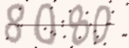
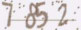
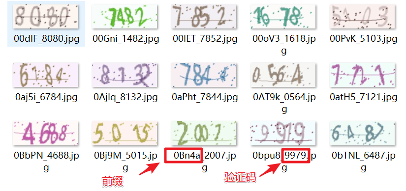

# 使用TensorFlow构建CNN网络破解验证码

## 验证码
既然要使用CNN来训练一个破解验证码的模型，我们首先需要去获标注好的验证码图像——即已经说明了图像验证码中验证码的确切值。我们使用的是Python中的[captcha库](https://github.com/lepture/captcha)来生成验证码图片，图片大小为160*60，文件名为前缀+验证码值。





可以在[generate_captcha.py](./generate_captcha.py)文件中修改我们需要生成验证码所需要的参数。`此次选取的验证码对象为四位数字验证码`

——有人要问为什么不去获取真实的验证码数据？

——获取真实的验证码图片容易，但是你需要对其进行标注，就很困难。比如你爬取了10万张验证码图片，但是你需要手工标注出这10万张图片的内容。

# 训练和测试
在[dataset.py](dataset.py)中，我们需要修改图片的大小和字符集合的大小。

PS:如果我们需要对数字+字母的混合验证码进行修改，我们需要集合集合的大小。

在[captcha_cnn.py](captcha_cnn.py)中
- 默认的日志输出路径为`./logs/`
- 默认的模型输出路径为`./model/`
- 我们通常只需要修改神经网络结构或者参数即可。
```
# 训练验证码数据的存放位置
captcha = captcha('D:\\Code\\TensorFlow-Train\\data-train\\')
# 训练
captcha.train_captcha_cnn()
```


```
# 测试验证码数据的存放位置
captcha = captcha('D:\\Code\\TensorFlow-Train\\data-train\\')
# 测试
captcha.test_captcha_cnn()
```


## 参考链接
[TensorFlow练习20: 使用深度学习破解字符验证码](http://blog.topspeedsnail.com/archives/10858)
[Tensorflow实战（二）：Discuz验证码识别](https://cuijiahua.com/blog/2018/01/dl_5.html)
[李宏毅机器学习(2017)](https://www.bilibili.com/video/av10590361)


